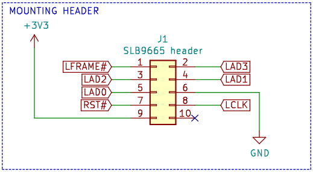

# TPM2 module schematics

TPM2 module PCB project for platforms with 2x5 pin, 2mm pitch LPC header was
created for the Librebox platform under contract work from Libretrend company.

## Description

Trusted Platform Module compatible with 2x5p LPC header (populated on Librebox
platform) can be used in:

* disk encryption
* password protection
* platform integrity and other security issues

TPM module for Librebox features:

* TPM SLB9665TT20FW561XUMA1
* Operating voltage 3-3.3V
* Meeting Intel TXT, Microsoft Windows and Google Chromebook certification
  criteria for successful platform qualification
* True Random Number Generator (TRNG)
* Full personalization with Endorsement Key (EK) and EK certificate
* Supports the LPC interface

## Pinout

The pin layout is unique therefore users of other platforms should first make
sure that the pinout corresponds to the one from the image below:

## Where can I buy this product?

If you are not the enthusiast of DYI, then the plug and play product can be
bought in the:

* [Libretrend shop](https://libretrend.com/specs/librebox)
* [3mdeb shop](https://shop.3mdeb.com/product/tpm2-module-for-librebox/)